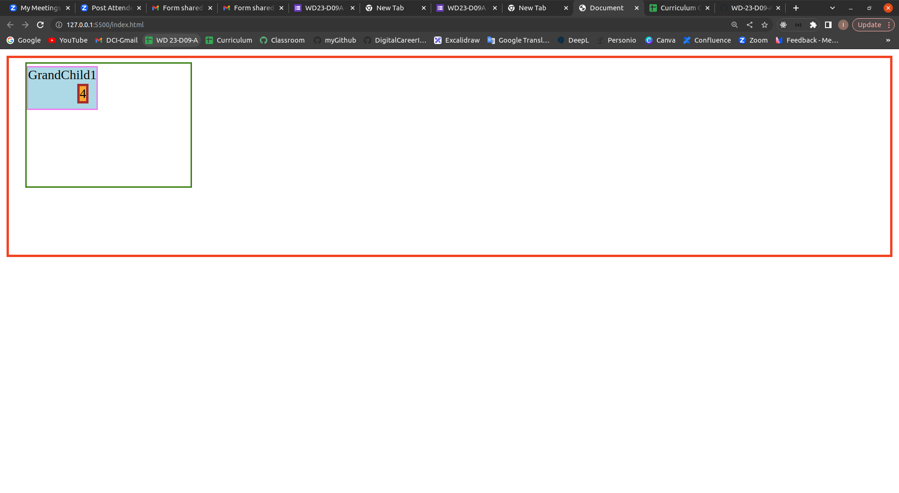

1. Erstellen einer Sticky-Überschrift: Implementiere eine Sticky-Überschrift, die oben auf der Seite bleibt, wenn der Benutzer nach unten scrollt. du verwendst position: sticky;, um diesen Effekt zu erzielen.

---

2. Make a Copy
 

---

3. Design a Horizontal Navigation Bar:
Create a horizontal navigation bar with menu items. Use margin and padding to space the menu items and make them visually appealing.